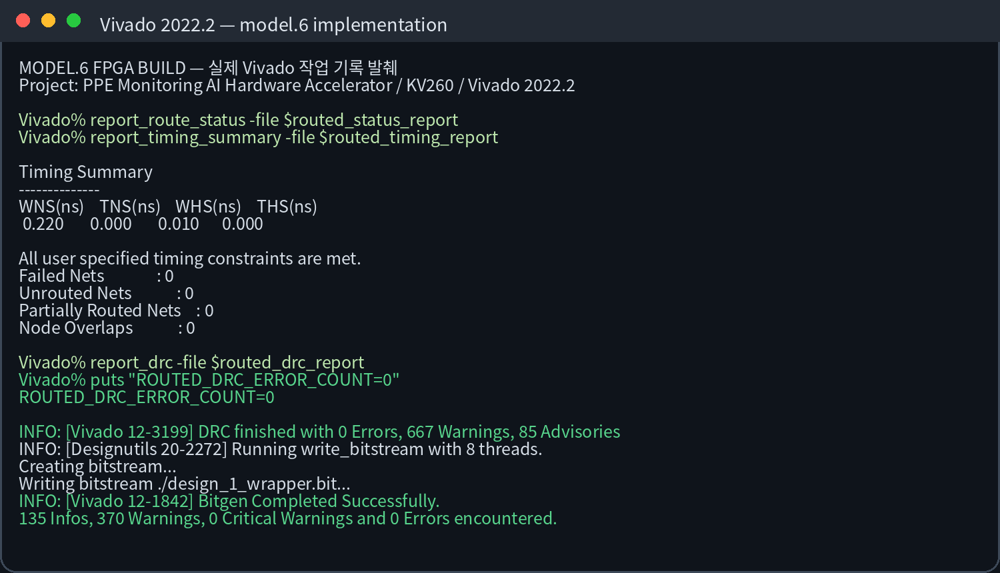

# 도면·인터페이스 해석 경험

Vivado Block Design은 실제 반도체 장비 회로도와 동일하지 않지만, 복잡한 시스템을 기능 블록과
신호 흐름으로 나누어 읽는 훈련에 활용했습니다.

## 분석 기준

| 경로 | 확인 내용 | 의미 |
|---|---|---|
| 제어 경로 | PS → AXI4-Lite → IP Register | 시작, 완료, Scale 등 낮은 대역폭 제어 |
| 입력 경로 | DDR → DMA MM2S → HLS IP | 메모리 데이터를 FPGA 연산부로 전달 |
| 출력 경로 | HLS IP → DMA S2MM → DDR | 연산 결과를 메모리로 반환 |
| 동기 경로 | PL Clock, Reset | 모든 블록의 동작 기준과 초기 상태 구성 |
| 데이터 규격 | Width, Shape, CHW/HWC, INT8 | 연결돼 있어도 결과가 틀릴 수 있는 조건 |

## 도면을 읽을 때 사용한 순서

1. 입력과 출력의 출발점·도착점 표시
2. Master/Slave 및 데이터 방향 확인
3. 제어 신호와 대용량 데이터 경로 분리
4. Clock Domain과 Reset polarity 확인
5. 주소 맵과 Register 폭 확인
6. 각 IP의 실제 `component.xml` 포트와 Block Design 비교
7. 연결 완료 후 Validate Design과 DRC로 재확인

## 직무 연결

이 경험은 장비 도면에서 전원, 제어, 통신, 센서·액추에이터 경로를 구분하고
이상 신호가 발생한 구간을 단계적으로 좁히는 기본 사고방식과 연결할 수 있습니다.

