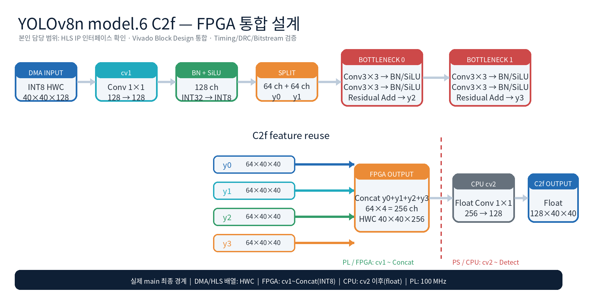

# FPGA 프로젝트 포트폴리오

## 한 문장 요약

낯선 FPGA 개발환경에서 로그, Block Design, 주소와 데이터 흐름을 근거로 문제 범위를
단계적으로 좁혀 Vivado Bitstream 생성과 KV260 Overlay 검증 단계까지 진행한 경험입니다.

## 직무 역량 연결

| 경험 | 확인 수단 | 장비 CS·공정 직무 연결 |
|---|---|---|
| 합성·구현 실패 분석 | Vivado 로그, DRC, Routing Report | Alarm과 로그를 이용한 고장 범위 축소 |
| Block Design 통합 | AXI, DMA, Clock, Reset, 주소 맵 | 회로도·배선도·I/O 흐름 해석 |
| 자원·배선 병목 분석 | LUT/DSP/BRAM, Timing Report | 제한 조건에서 병목 원인과 우선순위 판단 |
| Stream/DMA 교착 분석 | ready/valid, 전송 길이, 상태 레지스터 | 특정 부하에서 발생하는 간헐 장애 추적 |
| Golden Model 비교 | 형상, 레이아웃, 양자화, 출력 비교 | 설비 정상 종료와 제품 품질 정상의 분리 검증 |
| 새로운 도구 습득 | HLS→Vivado→Vitis→KV260 | 신규 장비·공정의 빠른 학습과 적용 |

## 문제 해결 방식

```text
현상 재현
→ 로그와 도면 확보
→ 제어/데이터/Clock/Reset으로 범위 분리
→ 최소 구성에서 가설 검증
→ 한 번에 하나의 변경 적용
→ 수정 전후 수치와 통과 단계 비교
→ 남은 한계 기록
```

## 문서 안내

1. [개인 역할과 경계](01_personal_contribution.md)
2. [트러블슈팅 사례](02_troubleshooting.md)
3. [도면·인터페이스 해석](03_diagram_and_interface_analysis.md)
4. [빠른 학습과 Codex 활용](04_learning_and_ai.md)
5. [결과·근거·한계](05_results_and_limits.md)
6. [자소서 소재 카드](06_job_application_cards.md)


